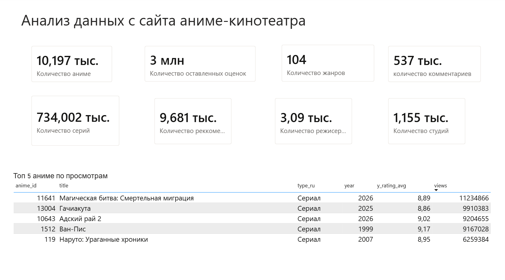
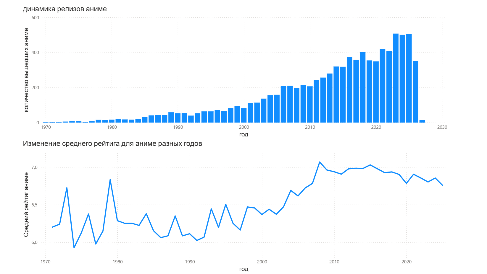
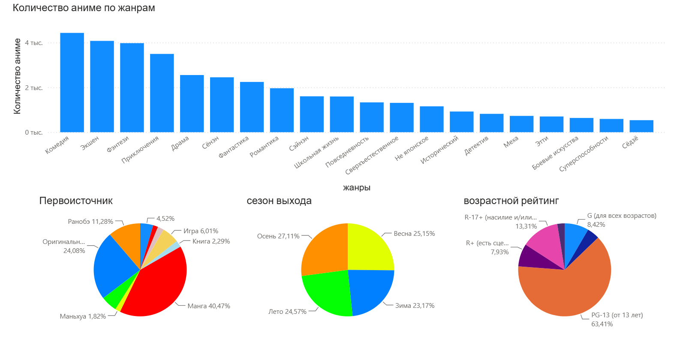
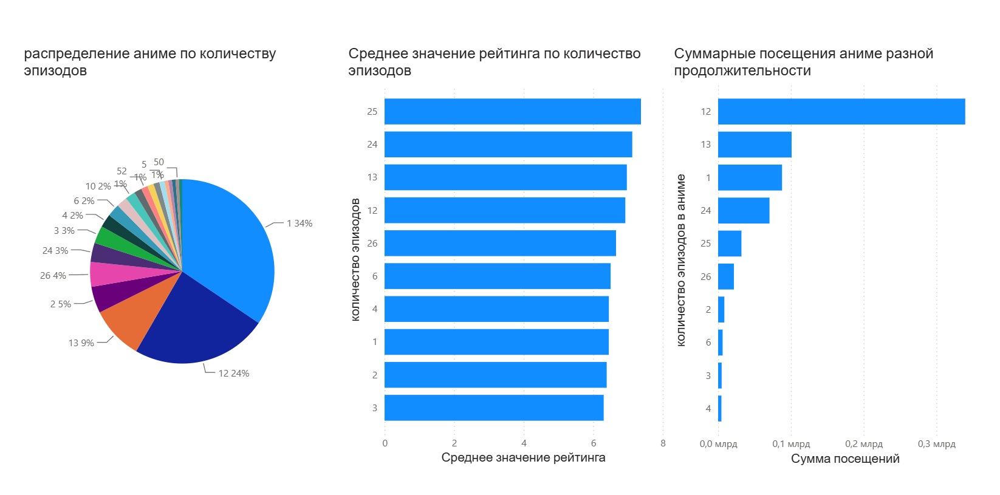

# Аналитика сайта для просмотра аниме

## Описание проекта

### Задача:
Сбор и анализ данных об аниме с целью создания рекомендательной модели

### Данные:
Данные собраны с [сайта онлайн-кинотеатра аниме](https://ru.yummyani.me) и сложены в PostgreS

Обзор платформы

<!-- 

Временные зависимости 

Распределения по жанрам, первоисточнику, времени года выхода аниме и возрастным ограничениям

Структура аниме по числу эпизодов
 -->

  
  

  
  

<!-- Обзор платформы
 -->

<!-- Обзор платформы
 -->

[тут](data_analys.ipynb) юпитер с EDA, feature engineering и обучением модели (knn)

В качестве доп. фичей используются эмбеддинги комментариев и описания аниме, их небольшой разбор можно глянуть в колабе 

Моделька рекомендаций обернута в [FastAPI-сервис](app/app.py), добавлен endpoint для предсказаний, сервис завернут в [Docker-контейнер](app/Dockerfile).  

Модель загружается при старте приложения, запросы отправляются через HTTP запрос с содержанием в JSON-формате
